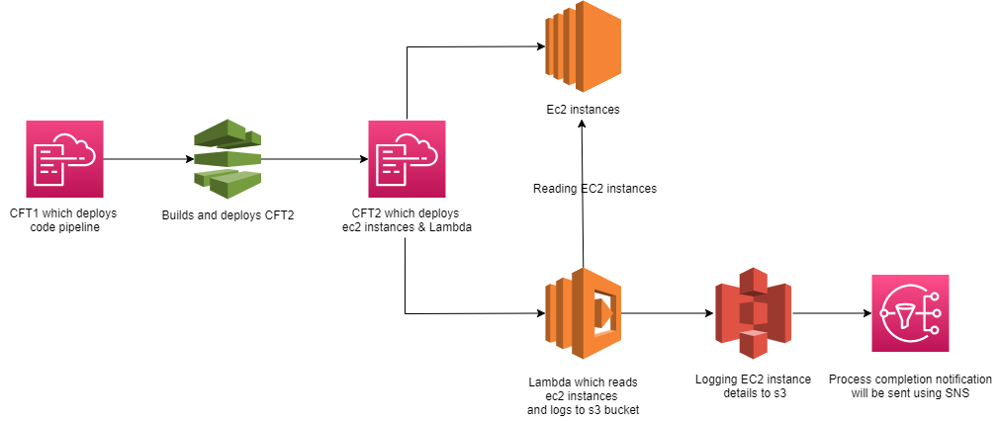
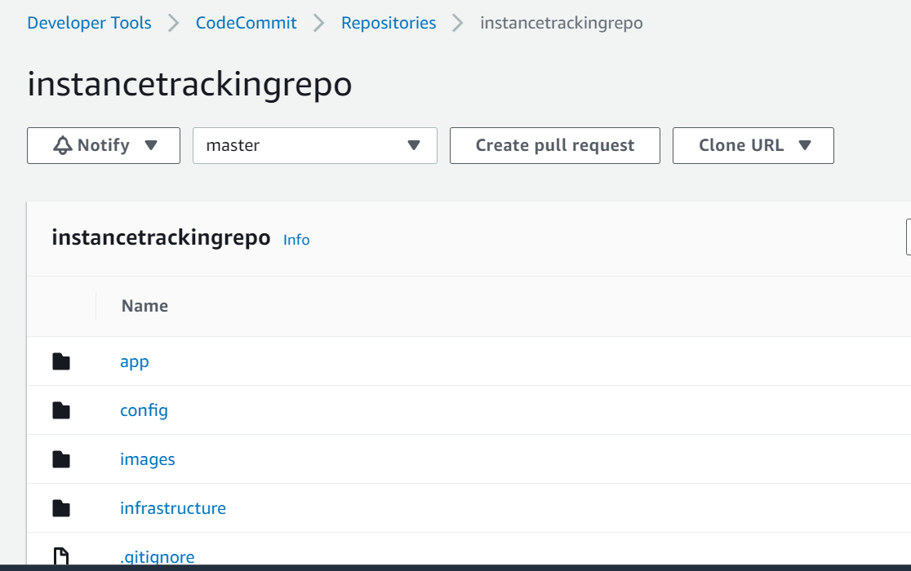
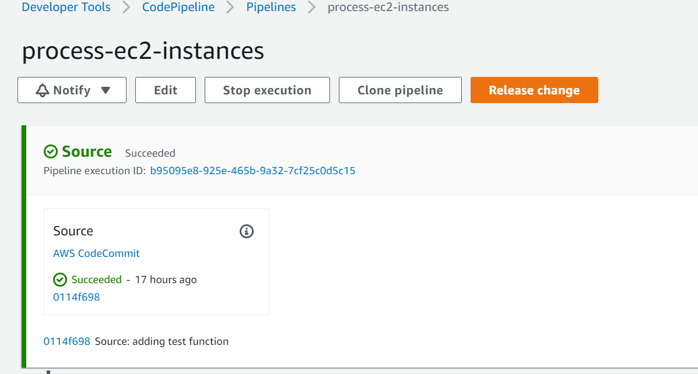
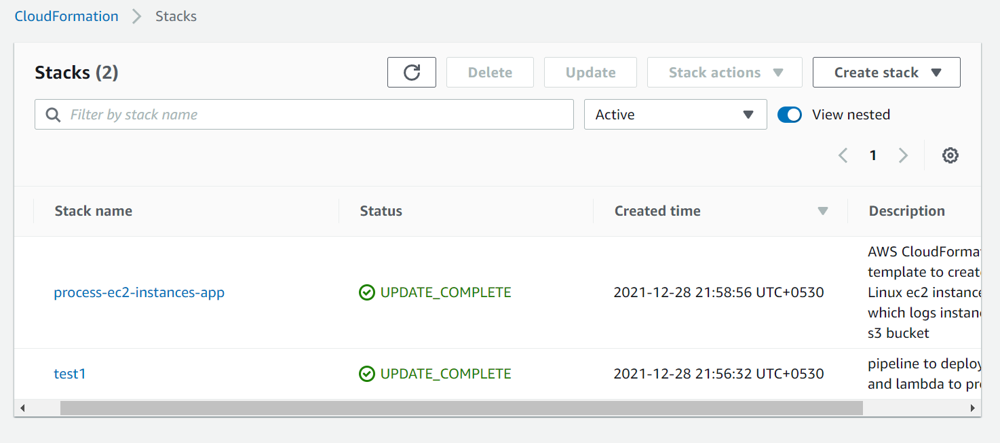
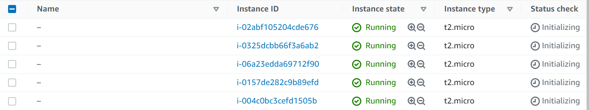
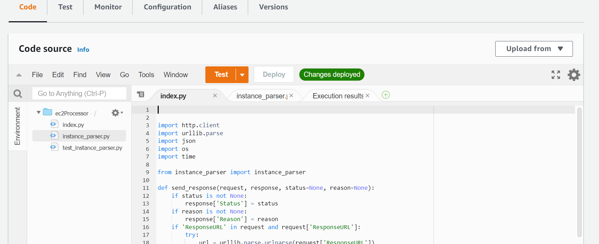
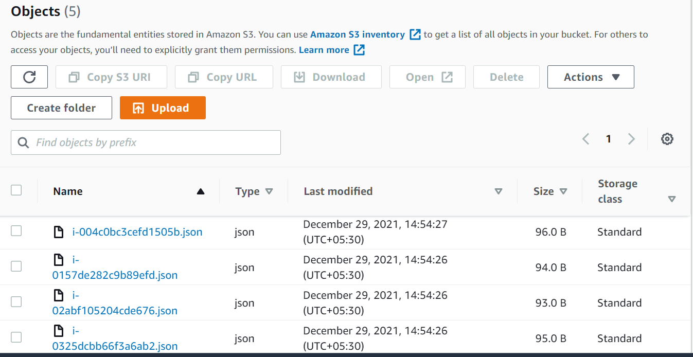
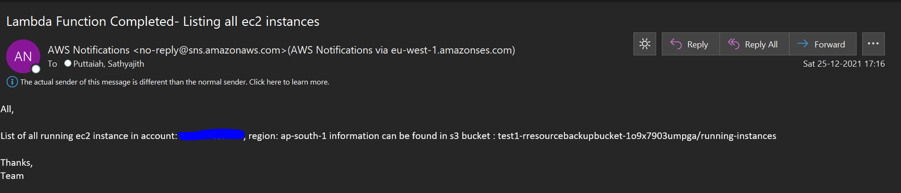

# Deployment Pipeline for Python Application on AWS

A continuous delivery pipeline for AWS Lambda and AWS CloudFormation.

### Services Used:

Services Used:
 
 * [AWS CodePipeline](https://aws.amazon.com/codepipeline/) for pipeline creation.
 * [AWS CodeBuild](https://aws.amazon.com/codebuild/) for testing and building your python application(s).
 * [AWS CloudFormation](https://aws.amazon.com/cloudformation/) for deploying infrastructure (Infrastructure-as-Code).
 * [AWS CodeDeploy](https://aws.amazon.com/codedeploy/) for zero downtime deployments of your application(s). 
 * [AWS Lambda](https://aws.amazon.com/lambda/) to process the ec2 instances. 
 * [AWS S3](https://aws.amazon.com/s3/) to store the instance information. 
 * [AWS SNS](https://aws.amazon.com/sns/) to send notifications to user. 

### Requirement:
Create a Cloudformation template which deploys 5 ec2 instances and then a lambda function which read these instances and logs the same in s3 bucket.
And deploy this using pipeline.

### Design:



### What does this repo contains?

### Source control
A pipeline will be configured in AWS CodePipeline. It will automatically monitor a code commit repository for modifications to applications or infrastructure and push them through the delivery pipeline.

### Build/test
 
[AWS CodeBuild](https://aws.amazon.com/codebuild) will be used to:

 - Build your python application.
 - Archive all build artifacts to S3.
 - We can also use it to run tests.

### Infrastructure as code

[AWS CloudFormation](https://aws.amazon.com/cloudformation) will be used to deploy python application on AWS.

By default, this will configure:

 - A VPC, with public subnets across single Availability Zones (AZs).
 - A Route table.
 - A Internet Gateway.
 - Security group.
 - Launch Template
 - EC2Fleet.
 - A Lambda
 - S3 bucket which stores all the ec2 instances information.

 ### Prerequisite

  * Need to have a Repo(Code Commit/ GitHub). Here I have made use of Code Commit.
  * In the [config/](config/) directory you will find a configuration file that you can use to override key settings, such as instance types, key-pair, mail id.

```json
{
    "Parameters": {
        "pNotifyEmail": "users@example.com",
        "pInstanceType": "t2.micro",
        "pKeyName": "keypair",
        "pSSHLocation": "0.0.0.0/0",
        "pUpdateHash": "0",
        "pDeploymentPackageKey": "abcd"
    }
}
```

Any changes made and committed back to your repository will be run through the pipeline and applied to your infrastructure/application automatically.

## How do I deploy this?

#### 1. Create a Code Commit repo and Git clone the same to one of your working stations.

This new repository will be used for developing your application, infrastructure, and pipeline

#### 2. Download the zip file and then extract the same.

Download the source code and then extract the same into your local repo.

#### 3. Deploy the pipeline to your AWS account

The pipeline is available as a AWS Cloudformation template. Need to deploy the codepipeline.yaml from AWS console.

You will need to provide some parameters.

After the [AWS CloudFormation](https://aws.amazon.com/cloudformation) stack has been created, you will find your new pipeline in the [AWS CodePipeline](https://aws.amazon.com/codepipeline) console.

#### 4. Develop, deploy, iterate

Now that your pipeline is setup, you can start developing your application, make some changes to application and then commit the same to your repository.

In the AWS CodePipeline console, you should see the changes you've made flow through the pipeline.

### How it works :

Besides a couple of necessary resources, like IAM roles, the core of the system is a combo of CodeCommit (code repository), CodeBuild (building, testing and packaging) and CodePipeline (deployment). It is the CodePipeline that ties it all together,.

The pipeline is defined in a couple of stages.

First stage is the `Source` stage. It listens to any changes made to the CodeCommit repository. A new commit on the `master` branch starts the pipeline.

The next stage, `CreateUpdatePipeline` is responsible for updating the pipeline itself. It takes the output of the `Source` stage as its input artifact and invokes CloudFormation to update itself. If there is any updates (e.g. you add or remove a stage), the pipeline is restarted after successfully applying the changeset.

Following the pipeline update stage is the `BuildAndTest` stage. It utilizes CodeBuild to do the work. Whatever is defined in the `buildspec.yaml` gets executed. If any of the [buildspec phases](http://docs.aws.amazon.com/codebuild/latest/userguide/build-spec-ref.html) fail, the whole pipeline will stop, yet it will still produce a `BuildOutput` artifact (handy for debugging, you can just download it from S3).

The last step is `CreateUpdateLambda`. It is similar to the second step, however uses a different CloudFormation template to manage the infrastructure.
This stage uses that template as its deployment target. It uses the [`ParameterOverrides`](http://docs.aws.amazon.com/AWSCloudFormation/latest/UserGuide/continuous-delivery-codepipeline-action-reference.html) to tell the lambda function where its deployment package (i.e. the ZIP file produced by CodeBuild during the `BuildAndTest` stage) is. And we also need to tell the lambda function also about the `ArtifactsBucket` - that's why it is defined as an Output of the `codepipeline.yaml` template.

Once the process is complete, user will get a email notification(have to subscribe).

### Screenshots:

#### 1. Code Commit Repo:



#### 2. Code Pipeline:



#### 3. Code Pipeline:


#### 4. Cloudformation templates:



#### 5. EC2 instancces:



#### 6. EC2 instancces:


#### 7. Lambda:



#### 7. S3 Logs:



#### 7. Email Notification:

